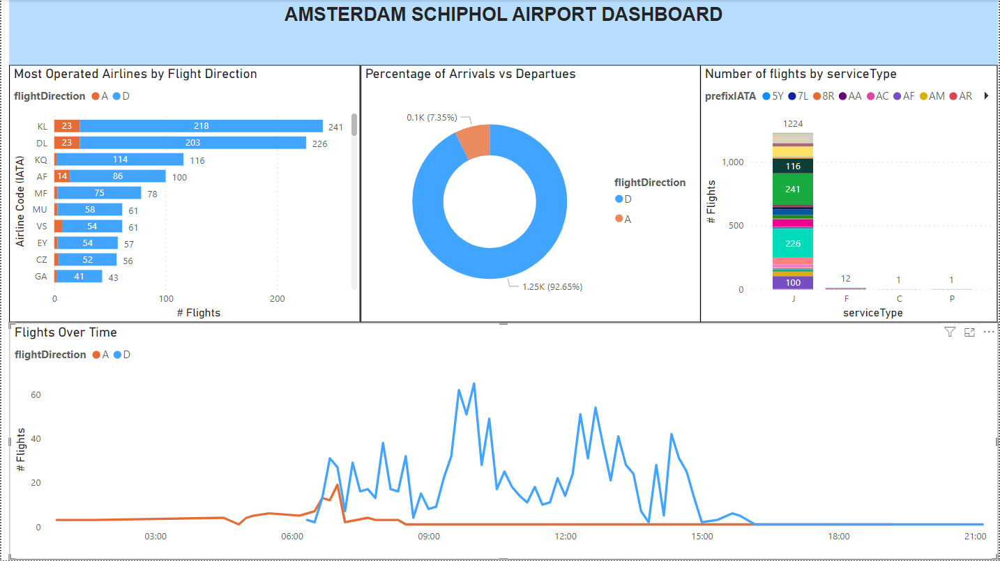

## Data Engineering project

This projects consists of simple Extract Transform Load pipeline. The steps followed during the development are listed below:

1. Download the data from the AMS Airport API - [here](https://developer.schiphol.nl/) 
2. Clean the data
3. Validate the data
4. Store the data
5. Create Dashboard

### Extract the data

The data is extracted from the Schipol Developer Center [website](https://developer.schiphol.nl/) and the endpoint is `flights`.

In this case, we are extracting arrivals and departues separately, as they have different columns, which need to be cleaned before saving them.

### Clean the data

For this part, we only keep columns of interest, and define the actual landing/departure time. Additioanlly,  `scheduleDateTime` is created combining `scheduleDate` and  `scheduleTime`.

### Validate the data

WIP

- Remove duplicates
- Outlier detection
- Missing values

### Store the data

The data is stored in  s3 bucket in AWS. To do so, first we save the file locally (`.parquet` format for memory optimization), and then upload it using the `boto3` package.

More details on how to upload files to s3 can be found [here](https://medium.com/@financial_python/uploading-files-to-aws-s3-using-python-and-boto3-622efbe1af5c).

[WIP] Finally, we can save the data in Data Warehouse, such as Snowflake.

### Create a dashboard

The dashboard will be created using Power BI (or alternatively Streamlit). It includes the following features:

- Most Operated Airlines by Flight Direction
- Percentage of Arrivals vs Departues
- Number of flights by serviceType
- Flights Over Time

The final output looks like this:

_Possible next steps could be:_

* Automate pipeline (e.g. using Airflow)

