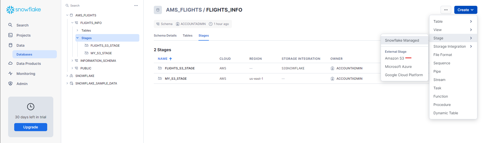
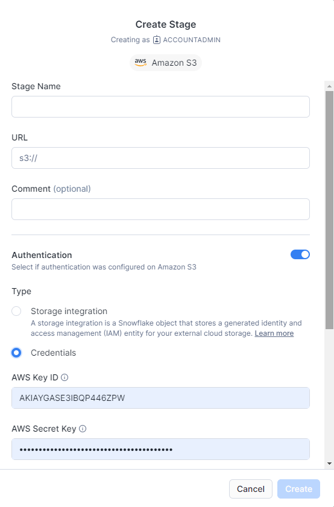
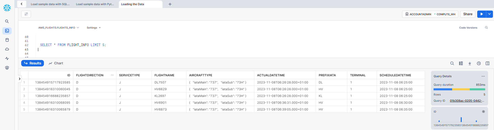

## Data Engineering project

This projects consists of simple Extract Transform Load pipeline. The steps followed during the development are listed below:

1. Download the data from the AMS Airport API - [here](https://developer.schiphol.nl/) 
2. Clean the data
3. Validate the data
4. Store the data
5. Create Dashboard

### Extract the data

The data is extracted from the Schipol Developer Center [website](https://developer.schiphol.nl/) and the endpoint is `flights`.

In this case, we are extracting arrivals and departues separately, as they have different columns, which need to be cleaned before saving them.

### Clean the data

For this part, we only keep columns of interest, and define the actual landing/departure time. Additioanally,  `scheduleDateTime` is created combining `scheduleDate` and  `scheduleTime`.

### Validate the data

WIP

- Remove duplicates
- Outlier detection
- Missing values

### Store the data

#### AWS S3 Bucket
The data is stored in  s3 bucket in AWS. To do so, first we save the file locally (`.parquet` format for memory optimization), and then upload it using the `boto3` package.

More details on how to upload files to s3 can be found [here](https://medium.com/@financial_python/uploading-files-to-aws-s3-using-python-and-boto3-622efbe1af5c).

#### Snowflake

[WIP] Finally, we can save the data in Data Warehouse, such as Snowflake. First of all, we need to create a Snowflake account (we can use the free tier).

Let's with the data ingestion into Snowflake:

1. Create Database and Schema
```sql
-- Create Database
CREATE DATABASE ams_flights;
USE DATABASE ams_flights;

-- Create a table on Snowflake to store the S3 data
CREATE SCHEMA flights_info;
USE SCHEMA flights_info;
```
2. Create Table
```sql
CREATE OR REPLACE TABLE flight_info(
    ID INT,
    FLIGHT_DIRECTION STRING,
    SERVICE_TRYPE STRING,
    FLIGHT_NAME STRING,
    AIRCRAFT_TYPE OBJECT,
    ACTUAL_DATE_TIME STRING,
    AIRLINE_CODE STRING,
    TERMINAL STRING,
    SCHEDULE_DATE_TIME STRING    
);
```
3. Create Stage


<div style="display: flex;">
    
    
</div>

4. Copy data from stage to table
```sql
 COPY INTO FLIGHT_INFO 
 FROM @my_s3_stage  
 FILE_FORMAT = (TYPE = 'PARQUET')
 ON_ERROR = 'CONTINUE';
```
5. Finally, we can query the data



Further improvements could be creating a real-time ingestion using the Snowflake `PIPE` function.

### Create a dashboard

The dashboard will be created using Power BI (or alternatively Streamlit). It includes the following features:

- Most Operated Airlines by Flight Direction
- Percentage of Arrivals vs Departures
- Number of flights by serviceType
- Flights Over Time

The final output looks like this:


_Possible next steps could be:_

* Automate pipeline (e.g. using Airflow)


